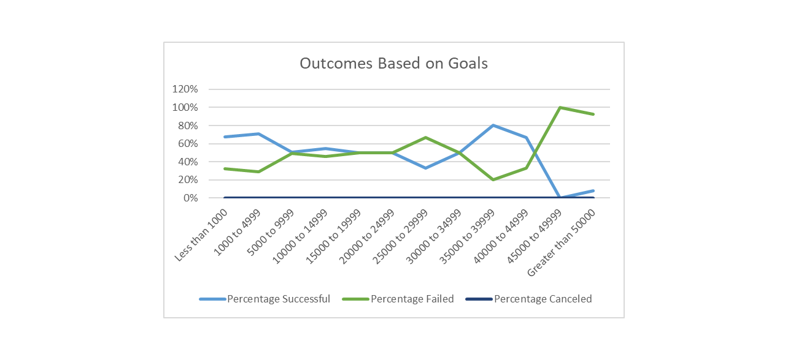

Kickstarter Analysis (Week 1 challenge) 
---
An Analysis of Kickstarter Campaigns
 
### Analysis of Outcomes based on Goals
--- 
In this analysis we looked at the outcomes (successful, failed, canceled) of kickstarter campaigns based on the the goals set for the fundraisers.  The analysis was limited to plays in the US. 
 Some conclusions:
 ---
*Most of the campaigns failed at the upper ranges of the goals which indicates that setting a goal too high may doom the campaign to failure
 ---
*There were no campaigns that were canceled for plays.
 ---
*The small numbers in the higher goal categories gave rise to some funky results, e.g. 80 percent success rate in the 35K-40K range (going somewhat against the trend).
 ---

Graphic:

Analysis of Outcomes based on Launch Date

In this analysis we used a pivot chart to analyze the outcomes Kickstarter campaigns for Theatre in the US by the month in which it was launched.

Some conclusions:

*The best month in which to start a campaign is May, with more than 60% of campaigns succeeding to reach their goal.  Generally, the summer time is the best time to start and achieve success.
*Failure rates seem to raise towards the end of summer, then go down towards the end of the year.
*Cancellations don't really factor in as there are not too many.  There appears also to be some missing data for some months.

.png)

###Challenge
